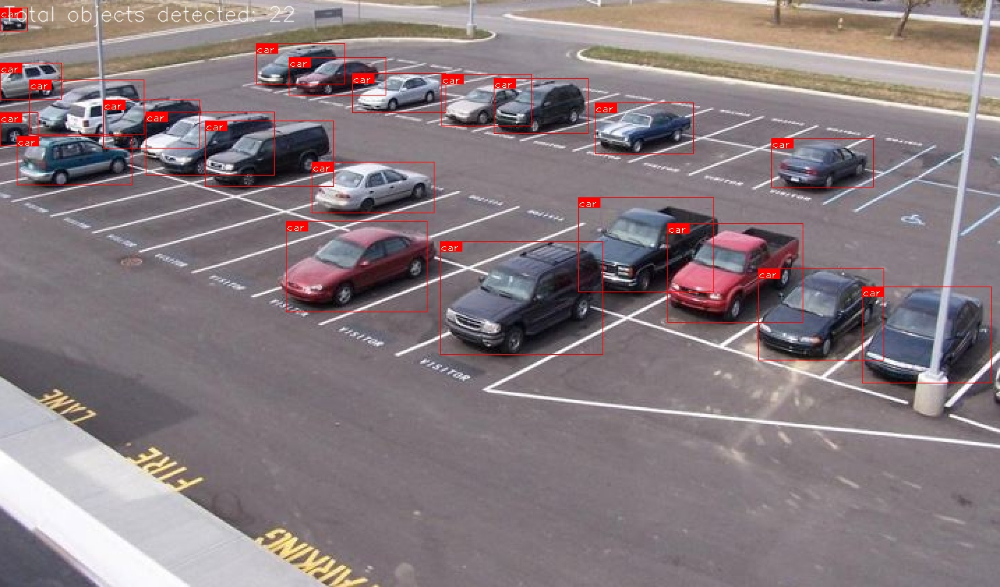

# YOLO Object Detection

This is a light-weight implementation of the YOLO v3 object detection model in PyTorch.
It's been adapted specifically for the use case of counting cars in surface lots, but is general enough to work with object detection for all 80 classes in the [COCO dataset](http://cocodataset.org/).

 
 

[YOLO PyTorch tutorial](https://blog.paperspace.com/how-to-implement-a-yolo-object-detector-in-pytorch/)

## Requirements

- `torch`
- `numpy`
- `opencv-python`
- Pre-trained weights file for YOLO v3: `wget https://pjreddie.com/media/files/yolov3.weights`

## Run
- `python demo.py`